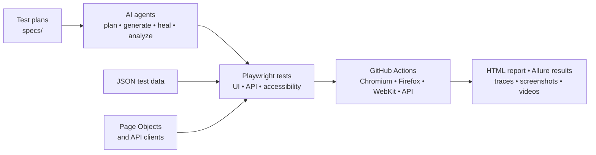

# Playwright AI-Assisted QA Portfolio

A production-style Playwright TypeScript framework that tests the SauceDemo storefront across Chromium, Firefox, and WebKit. It demonstrates maintainable UI automation, CI evidence, and safe specialist-agent workflows.

> **Portfolio project:** built to demonstrate how I design, scale, and diagnose reliable web UI automation.

## What this project demonstrates

- Page Object Model with typed, reusable page classes
- Data-driven UI and API tests
- Keyboard accessibility coverage for the login flow
- Stable locator strategy: accessible roles first, then application test IDs
- Smoke, critical, and regression test tags
- Cross-browser execution, traces, screenshots, videos, HTML reports, and Allure results
- GitHub Actions browser sharding with downloadable test evidence
- Three scoped AI agents: planner, generator, and healer

## Quick start

```powershell
npm ci
npx playwright install
npm test
```

Run the most important tests quickly:

```powershell
npm run test:smoke
```

Open the local HTML report:

```powershell
npm run test:report
```

## Test architecture

```text
tests/                 Test scenarios organized by user flow
tests/data/            JSON test data
src/pages/             Page Objects: locators and user actions
src/api/               Typed API clients and reusable request behavior
src/fixtures/base.ts   Shared authenticated-page fixture
specs/                 Human-readable test plans
.github/agents/        AI agent instructions
.github/workflows/     Sharded CI pipeline
```

Tests contain assertions. Page Objects contain locators and actions. This separation makes UI changes cheaper to maintain.

## Architecture at a glance



## Architecture decisions

| Decision | Why it matters |
| --- | --- |
| Page Objects | Keeps UI selectors and user actions reusable; a UI change is fixed once rather than in every test. |
| JSON test data | Separates test scenarios from credentials and customer input. |
| Web-first assertions | Playwright waits for an observable state instead of using unreliable fixed sleeps. |
| Browser matrix | Catches rendering and browser-engine differences before a user does. |
| Retained failure artifacts | A trace, screenshot, and video make a failed CI run diagnosable after the fact. |
| Scoped AI agents | Automation is useful only when its permissions and quality constraints are explicit. |

## AI-agent workflow

1. The **Planner** explores a safe environment and writes a numbered test plan in `specs/`.
2. The **Generator** implements a selected scenario using existing Page Objects and test data.
3. CI runs the chosen browser shard and saves HTML, Allure, trace, screenshot, and video evidence.
4. The **Healer** diagnoses failures without hiding regressions, weakening assertions, or skipping tests.
5. The **Coverage Analyst** maps planned scenarios to tests and exposes gaps.
6. The **API Test Generator** creates safe, typed API coverage from an approved plan.
7. The **PR Review Agent** runs after a pull request is opened or updated. It checks changed code against repository rules, posts one updateable review report, and blocks only explicit rule violations.
8. The **CI Failure Triage Agent** writes an evidence-based failure classification into the `test-results` artifact when a Playwright CI job fails. It never changes code or claims a root cause without evidence.
9. The **Test Impact Analyst** maps PR changes to focused tests for quick feedback. It is advisory: the full cross-browser and API CI matrix remains the merge safety net.
10. The **Release Risk Analyst** summarizes initial change-scope risk, required test evidence, and ownership prompts for QA and release decisions. It never approves a release.

The PR Review Agent is deterministic, not an autonomous approver: it does not edit code, approve pull requests, merge branches, or replace human review.

Run the same static review locally before raising a PR:

```powershell
npm run review:pr -- --base main
```

Run a local test-impact analysis with:

```powershell
npm run impact:tests -- --base main
```

Run a local initial release-risk analysis with:

```powershell
npm run risk:release -- --base main
```

## CI evidence

The GitHub Actions workflow runs UI tests per browser and API tests once, then uploads these artifacts for each job:

- `playwright-report-<browser>`: interactive HTML results
- `test-results-<browser>`: trace, screenshot, video, and failure context
- `allure-results-<browser>`: raw Allure result files

This makes a test result reviewable after the run—not merely a green or red badge.

The browser cache and per-project installation keep later CI runs faster while preserving isolated browser evidence.

## Agent evaluation scorecard

The repository separates agent **definitions** from agent **evidence**. The Planner, Generator, Healer, Coverage Analyst, and API Test Generator start as `defined-not-evaluated`; they do not earn production, autonomous, cost, or success-rate claims merely by existing.

Record a real run with its input, output, human-review decision, failure category, and evidence reference in [`tests/data/agent-evaluations.json`](tests/data/agent-evaluations.json). Generate the live Markdown scorecard with:

```powershell
npm run report:agents
```

See [`specs/agent-evaluation-scorecard.md`](specs/agent-evaluation-scorecard.md) for the required evidence and example entry.

## Quality gates

Before a change is considered ready, it should:

1. Pass the smoke suite locally: `npm run test:smoke`
2. Pass all three browser projects in CI
3. Retain failure evidence for any failing run
4. Follow the locator and Page Object conventions in `AGENTS.md`
5. Keep agent changes reviewable: plans, generated tests, and repairs each have a defined scope
6. Resolve any blocking PR Review Agent finding before merge

## Interview talking points

- “I used Page Objects so test intent stays readable and locator changes are centralized.”
- “I use web-first assertions and Playwright auto-waiting instead of fixed sleeps.”
- “The CI matrix isolates browser-specific failures and retains debugging artifacts.”
- “My AI agents have narrow permissions: planning, generation, and conservative failure diagnosis.”
- “I preserve test intent: a failing test can reveal a product bug, not necessarily a test bug.”
- “After a PR is raised, a repository-rule review agent posts a repeatable report and works alongside—not instead of—human review and CI.”

## Note on SauceDemo locators

SauceDemo exposes `data-test` attributes rather than this repository’s preferred `data-test-id`. The Playwright configuration explicitly supports `data-test` for this third-party demo site. For an application your team owns, prefer a documented `data-test-id` convention.

## Portfolio walkthrough

For a five-minute demo, run `npm run test:smoke`, open the HTML report, then explain one flow: login → inventory → cart → checkout confirmation. Follow it by showing the corresponding Page Objects and the browser-matrix workflow. This demonstrates both coding ability and the judgment behind the framework.

## Copyright and commercial use

Copyright © 2026 Manjunath K. All rights reserved.

This repository is shared as a portfolio for review and evaluation. No permission is granted to copy, modify, distribute, sublicense, sell, or otherwise use this project's original source code or documentation for commercial purposes without prior written permission from the copyright holder. See [LICENSE](LICENSE) for details.

## PR quality governance

This repository uses deterministic code review, test-impact analysis, and release-risk analysis to support human PR review.
