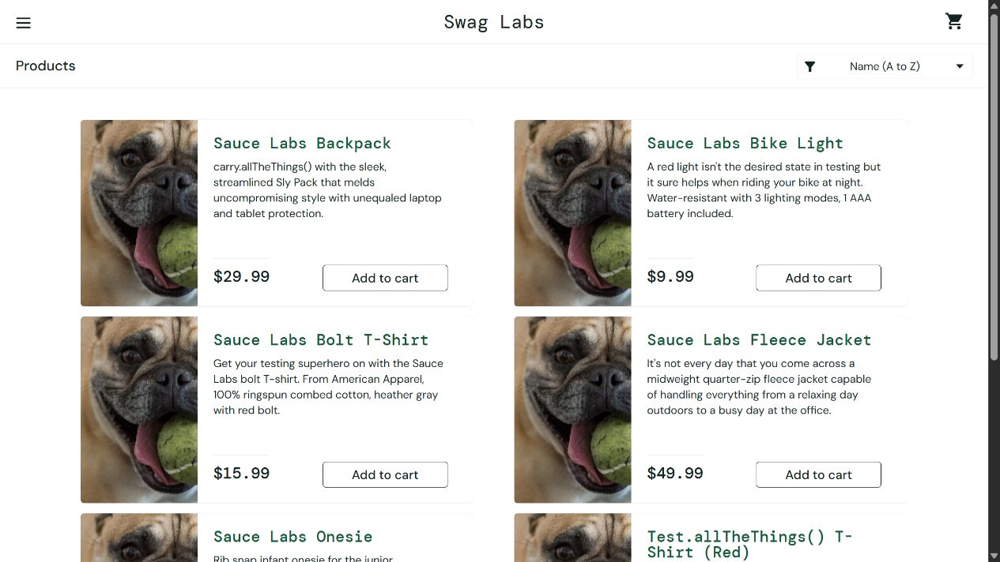
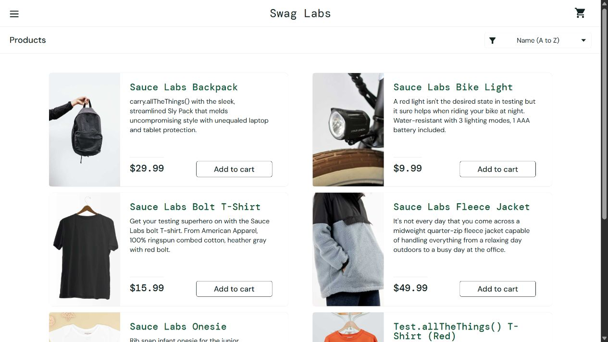

# Sample Bug Reports

These reports use SauceDemo's intentionally defective public personas. They demonstrate defect-writing and evidence capture; they are not claims about a production system. Reproduced on 2026-08-27 in the current Chromium-based in-app browser.

## BUG-001 — All catalogue items show the same incorrect image

- Severity: Medium | Priority: P1 | Status: Reproduced
- Environment: `https://www.saucedemo.com/inventory.html`, user `problem_user`
- Preconditions: Fresh session; public password `secret_sauce`

Steps to reproduce:

1. Sign in as `problem_user`.
2. Review the six product cards on the Products page.

Expected: Each product shows an image that corresponds to its name (backpack, bike light, T-shirt, jacket, onesie, red T-shirt).

Actual: Every card shows the same dog image, so the visual catalogue does not correspond to the product names.

Impact: Shoppers cannot visually distinguish products and may make an incorrect selection. Text remains available, so checkout is not fully blocked.

Evidence: [BUG-001 screenshot](evidence/BUG-001-problem-user-product-images.png)

## BUG-002 — Price sort selection does not reorder the catalogue

- Severity: High | Priority: P1 | Status: Reproduced
- Environment: `https://www.saucedemo.com/inventory.html`, user `error_user`
- Preconditions: Fresh session; public password `secret_sauce`

Steps to reproduce:

1. Sign in as `error_user`.
2. In the sort control, select **Price (low to high)**.
3. Read the displayed prices from top left to bottom right.

Expected: The selection changes to **Price (low to high)** and prices reorder to `$7.99, $9.99, $15.99, $15.99, $29.99, $49.99`.

Actual: The selection changes, but the catalogue remains in its original order: `$29.99, $9.99, $15.99, $49.99, $7.99, $15.99`.

Impact: The UI confirms a sort that was not applied, potentially misleading shoppers and preventing price-based comparison.

Evidence: [BUG-002 screenshot](evidence/BUG-002-error-user-sort-failure.png)

